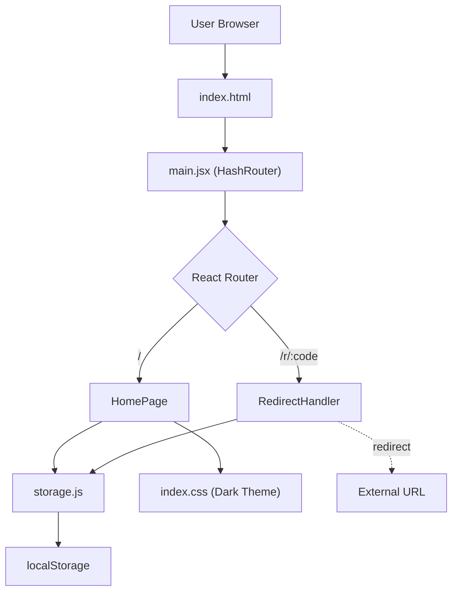

# Product Requirements Document (PRD)

## LinkSnip — URL Shortener & Analytics

**Version**: 1.0.0  
**Date**: March 9, 2026  
**Author**: Sanchit K Panda  
**Status**: MVP Released  
**Repository**: [sanchit-K-panda/link-analytics-shortener](https://github.com/sanchit-K-panda/link-analytics-shortener)

---

## 1. Product Overview

**LinkSnip** is a lightweight, client-side URL shortener with built-in click analytics. It allows users to shorten long URLs into compact, trackable short links and monitor engagement through a real-time dashboard — all from the browser with zero backend dependencies.

### 1.1 Vision
Provide a fast, privacy-first URL shortening tool that runs entirely in the browser, requiring no sign-ups, no servers, and no third-party tracking.

### 1.2 Target Audience
- Developers and tech-savvy users who need quick, disposable short links
- Hackathon participants (built for **VIBEATHON 2026**)
- Students and indie makers who want a simple analytics dashboard without SaaS costs

---

## 2. Problem Statement

Existing URL shorteners (Bitly, TinyURL, etc.) require:
- Account creation and authentication
- Backend infrastructure and databases
- Paid plans for analytics and branding

**LinkSnip** eliminates these barriers by running entirely in the browser using localStorage for persistence.

---

## 3. Goals & Success Metrics

| Goal | Metric | Target |
|---|---|---|
| Instant link creation | Time from paste to short link | < 1 second |
| Zero-friction UX | Steps to create first link | 2 (paste + click) |
| Click tracking accuracy | Clicks recorded vs actual redirects | 100% (same-origin) |
| Mobile usability | Fully responsive UI | All breakpoints ≤ 480px |

---

## 4. Features & Requirements

### 4.1 Core Features (v1.0 — Current)

| # | Feature | Priority | Status |
|---|---|---|---|
| F1 | **URL Shortening** — Paste a URL, generate a 6-character alphanumeric short code | P0 | ✅ Done |
| F2 | **URL Validation** — Reject invalid URLs (must start with `http://` or `https://`) | P0 | ✅ Done |
| F3 | **Click Tracking** — Increment click count on each short link visit | P0 | ✅ Done |
| F4 | **Analytics Dashboard** — Table view showing all links with click counts, dates, and original URLs | P0 | ✅ Done |
| F5 | **Stats Summary** — Cards showing Total Links, Total Clicks, and Most Clicks | P1 | ✅ Done |
| F6 | **Copy to Clipboard** — One-click copy of short URLs with visual feedback | P1 | ✅ Done |
| F7 | **Redirect Handler** — Route `/r/:code` resolves short codes and redirects to original URL | P0 | ✅ Done |
| F8 | **404 Handling** — Invalid short codes redirect back to homepage | P1 | ✅ Done |
| F9 | **Responsive Design** — Works on desktop, tablet, and mobile | P1 | ✅ Done |
| F10 | **Dark Theme** — Premium dark UI with gradient accents and glassmorphism | P2 | ✅ Done |

### 4.2 Planned Features (v2.0 — Future)

| # | Feature | Priority | Status |
|---|---|---|---|
| F11 | **Delete Links** — Remove individual links from the dashboard | P1 | 🔲 Planned |
| F12 | **Edit Links** — Modify the original URL of an existing short link | P2 | 🔲 Planned |
| F13 | **QR Code Generation** — Generate QR codes for each short link | P2 | 🔲 Planned |
| F14 | **Custom Short Codes** — Let users choose their own short code (e.g., `my-brand`) | P1 | 🔲 Planned |
| F15 | **Click Analytics Charts** — Visual charts (bar/line) for click trends over time | P2 | 🔲 Planned |
| F16 | **Link Expiration** — Set TTL (time-to-live) for auto-expiring links | P3 | 🔲 Planned |
| F17 | **Export Data** — Download link data as CSV/JSON | P2 | 🔲 Planned |
| F18 | **Backend Integration** — Optional Supabase/Firebase backend for cross-device persistence | P1 | 🔲 Planned |
| F19 | **User Authentication** — Login to save and sync links across devices | P2 | 🔲 Planned |
| F20 | **Search & Filter** — Search links by URL or filter by date/clicks | P2 | 🔲 Planned |

---

## 5. Technical Architecture

### 5.1 Tech Stack

| Layer | Technology |
|---|---|
| **Framework** | React 18 |
| **Build Tool** | Vite 6 |
| **Routing** | React Router DOM 6 (HashRouter) |
| **Styling** | Vanilla CSS with CSS custom properties |
| **Typography** | Inter (Google Fonts) |
| **Persistence** | localStorage |
| **Deployment** | Vercel (static site) |

### 5.2 Architecture Diagram



### 5.3 Data Model

Each link is stored as a JSON object in localStorage under key `linksnip_links`:

```json
{
  "id": "aB3xYz",
  "originalUrl": "https://example.com/very-long-url",
  "shortCode": "aB3xYz",
  "clicks": 12,
  "createdAt": "2026-03-09T10:00:00.000Z"
}
```

### 5.4 File Structure

```
link-analytics-shortener/
├── index.html                  # Entry HTML with meta tags & fonts
├── package.json                # Dependencies & scripts
├── vite.config.js              # Vite configuration
├── vercel.json                 # Vercel deployment config
└── src/
    ├── main.jsx                # App entry — StrictMode + HashRouter
    ├── App.jsx                 # HomePage + routing (core logic)
    ├── index.css               # Full design system (627 lines)
    ├── components/
    │   └── RedirectHandler.jsx # Short link redirect + click tracking
    └── utils/
        └── storage.js          # localStorage CRUD operations
```

---

## 6. User Flows

### 6.1 Create a Short Link
1. User pastes a URL into the input field
2. Clicks "Shorten" button
3. System validates the URL format
4. System generates a unique 6-character short code
5. Link is saved to localStorage
6. Success banner appears with the short URL + copy button
7. Link appears at the top of the dashboard table

### 6.2 Visit a Short Link
1. Someone clicks a short link (e.g., `https://app.vercel.app/#/r/aB3xYz`)
2. `RedirectHandler` component loads
3. System looks up the short code in localStorage
4. Click count is incremented
5. User is redirected to the original URL
6. If code not found → redirected to homepage

### 6.3 View Analytics
1. User visits the homepage
2. Stats cards show Total Links, Total Clicks, Most Clicks
3. Dashboard table lists all links (newest first) with click counts
4. User can click "Refresh" to reload data from localStorage

---

## 7. Design Specifications

### 7.1 Color Palette

| Token | Value | Usage |
|---|---|---|
| `--bg-primary` | `#0a0a0f` | Page background |
| `--bg-secondary` | `#12121a` | Input/card backgrounds |
| `--accent` | `#6366f1` | Primary brand (Indigo) |
| `--purple` | `#a855f7` | Secondary accent |
| `--green` | `#22c55e` | Success states |
| `--red` | `#ef4444` | Error states |
| `--text-primary` | `#f1f1f4` | Headings & body |
| `--text-secondary` | `#8b8b9e` | Labels & secondary text |
| `--text-muted` | `#5a5a6e` | Placeholders & hints |

### 7.2 Typography
- **Font Family**: Inter (weights: 300–800)
- **Heading**: 2.2rem, weight 800, gradient fill
- **Body**: 0.95rem, weight 400
- **Labels**: 0.78rem, uppercase, letter-spacing 0.06em

### 7.3 Responsive Breakpoints

| Breakpoint | Adjustments |
|---|---|
| `≤ 768px` | Stack stat cards, hide row numbers, stack form vertically |
| `≤ 480px` | Reduce heading size, smaller subtitle |

---

## 8. Constraints & Limitations

| Constraint | Impact | Mitigation |
|---|---|---|
| **Client-side only** | Data is per-browser, not cross-device | Future: backend integration (F18) |
| **localStorage limit** | ~5MB storage cap | Sufficient for thousands of links |
| **Same-origin only** | Short links only work from the same deployed app URL | Deploy to a memorable domain |
| **No auth** | Anyone with app access can see all links | Future: user authentication (F19) |
| **No delete/edit** | Links are permanent once created | Planned for v2.0 (F11, F12) |

---

## 9. Deployment

| Platform | URL | Method |
|---|---|---|
| **Vercel** | _(auto-assigned)_ | Git push triggers auto-deploy |
| **Build command** | `npx vite build` | Via `vercel.json` config |
| **Output directory** | `dist` | Static SPA with hash routing |

---

## 10. Appendices

### A. Glossary

| Term | Definition |
|---|---|
| **Short Code** | 6-character alphanumeric string (e.g., `aB3xYz`) used to identify a link |
| **Hash Routing** | Uses `#/` in URLs for SPA routing without server-side rewrites |
| **Glassmorphism** | UI design trend using translucent, blurred backgrounds |

### B. References
- [Vite Documentation](https://vitejs.dev/)
- [React Router v6](https://reactrouter.com/)
- [Vercel Deployment](https://vercel.com/docs)
